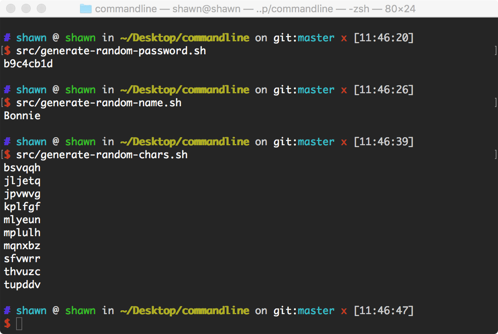
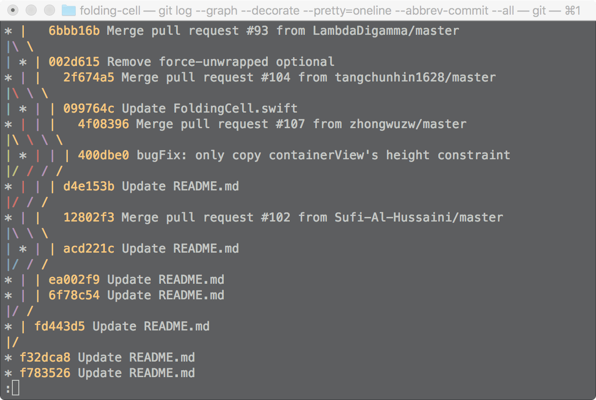
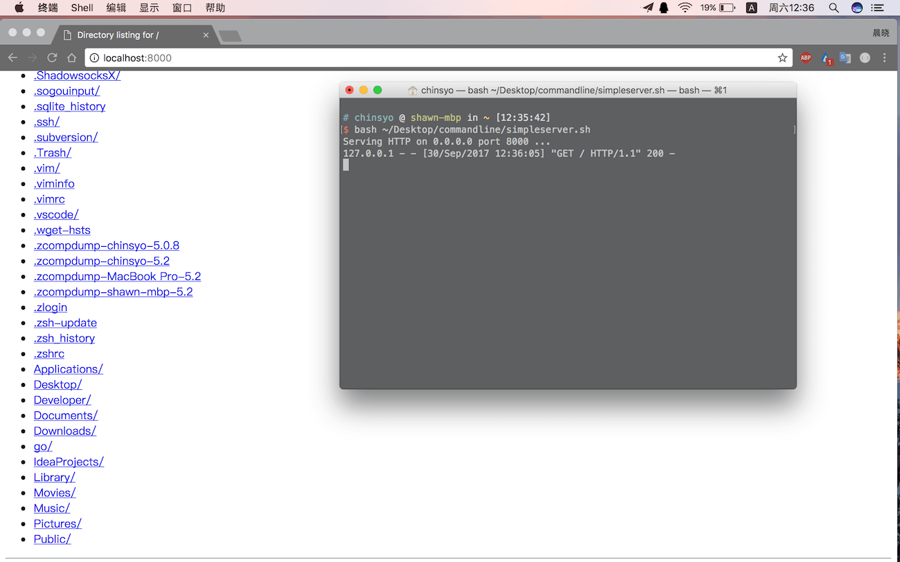

# commandline
53 Useful bash scripts collection on Mac OSX.(实用的命令行脚本)
* avoid-mac-sleeping
```bash
#! /bin/bash

caffeinate -u -t 3600

```

* background-jobs
```bash
#! /bin/sh

# Run command background
sleep 100 &

# List jobs background
jobs

# Bring command to front
fg %1

```

* backup-current-directory
```bash
#! /bin/bash

DATE=`date "+%Y_%m_%d_%H_%M_%S"`
tar -czvf  ~/Desktop/${DATE}.tar ./*

echo ""
echo "*** Back up success, go to ~/Desktop/${DATE}.tar ***"
echo ""

```

* base64-encode-and-decode
```bash
#! /bin/bash

echo -n "hello" | base64

echo -n "aGVsbG8=" | base64 -D

```

* batch-create-files
```bash
#! /bin/bash

seq -w -f "content%g" 10000 10 11000 | xargs touch

```

* clean-zsh-history
```bash
#! /bin/bash

echo "" > ~/.zsh_history & exec $SHELL -l

```

* cleanup-any-npm-file
```bash
#! /bin/bash

npm ls -gp --depth=0 | awk -F/ '/node_modules/ && !/\/npm$/ {print $NF}' | xargs npm -g rm

```

* convert-file-format
```bash
#! /bin/bash

textutil -convert html file.ext

```

* convert-ringtone-format
```bash
#! /bin/bash

afconvert input.mp3 rintone.m4r -f m4af

```

* cpu-brand
```bash
#! /bin/bash

sysctl -n machdep.cpu.brand_string

```

* create-audiobook
```bash
#! /bin/sh

say -v Alex -f file.txt -o "output.m4a"

```

* create-empty-file
```bash
#! /bin/bash

mkfile 10g ~/Desktop/file

```

* current-wifi
```bash
#! /bin/bash

airport -I | awk '/ SSID/ {print substr($0, index($0, $2))}'

```

* enable-quicklook-selection
```bash
#! /bin/bash

defaults write com.apple.finder QLEnableTextSelection -bool TRUE;
killall Finder;

```

* extract-device-udid
```bash
#! /bin/bash

system_profiler SPUSBDataType | sed -n -e '/iPad/,/Serial/p' -e '/iPhone/,/Serial/p'


```

* flush-dns-cache
```bash
#! /bin/bash

sudo killall -HUP mDNSResponder;
say "DNS cache flushed."

```

* generate-random-chars

```bash
#! /bin/sh

jot -r -c 60 a z | rs -g 0 6 | sort | uniq

```

* generate-random-name
```bash
#! /bin/sh

cat /usr/share/dict/propernames | sort -R | head -n 1

```

* generate-random-password
```bash
#! /bin/sh

date | md5 | head -c8; echo

```

* git-rebase-auto-squash
```bash
#! /bin/bash

git add featureA
git commit -m "Feature A is done"
# [dev fb2f677] Feature A is done

git add featureB
git commit -m "Feature B is done"
# [dev 733e2ff] Feature B is done

git add featureA
git commit --fixup fb2f677
# [dev c5069d5] fixup! Feature A is done

git log --oneline
# c5069d5 fixup! Feature A is done
# 733e2ff Feature B is done
# fb2f677 Feature A is done
# ac5db87 Previous commit

git rebase -i --autosquash ac5db87
# pick fb2f677 Feature A is done
# fixup c5069d5 fixup! Feature A is done
# fixup c9e138f fixup! Feature A is done
# pick 733e2ff Feature B is done

```

* go-source-code-line-count
```bash
#! /bin/bash

find . -name '*.go' | xargs wc -l | sort -nr

```

* graphic-git-logs

```bash
#! /bin/bash

git log --graph --decorate --pretty=oneline --abbrev-commit --all

```

* install-all-system-update
```bash
#! /bin/bash

softwareupdate -ia

```

* join-wifi
```bash
#! /bin/bash

# Replace WIFI_SSID and WIFI_PASSWORD with actual
networksetup -setairportnetwork en0 WIFI_SSID WIFI_PASSWORD

```

* key-repeat-rate
```bash
#! /bin/bash

defaults write -g KeyRepeat -int 0.02

```

* latest-power-on-time
```bash
#! /bin/bash

last | awk 'NR==1 {print $6}'
```

* md5encode
```bash
#! /bin/bash

md5 -xs "Hello world!"

```

* most-used-command
```bash
#! /bin/bash

history | awk '{CMD[$2]++;count++;} END { for (a in CMD )print CMD[a] " " CMD[a]/count*100 "% " a }' | grep -v "./" | column -c3 -s " " -t | sort -nr | nl | head -n10

```

* pip-update
```bash
#! /bin/bash

echo "starting upgrade pip packages..."
pip3 list --outdated --format=columns | awk "NR>2 {print $1}" | xargs -n1 pip3 install --user --upgrade
echo "finished upgrade pip packages..."

```

* print-environment
```bash
#! /bin/bash

printenv

```

* python-packages-count
```bash
#! /bin/sh

pip3 list --format=columns | tail +3 | wc -l

```

* python-source-file-count
```bash
#! /bin/bash

tree | grep '.py$' | wc -l

```

* query-terminfo-database
```bash
#! /bin/bash

# clear the screen
tput clear

# save cursor position
tput sc

# move cursor position
tput cup 10 13

# hide cursor
tput civis

# show cursor
tput cnorm

# show output
tput rc

```

* rename-git-remote-repo
```bash
#! /bin/bash

# print current remote repo url
git remote -v;

# after go to github.com and edit your repo name
# execute command below to set remote name and url
git remote set-url $0 $1; 

git remote -v;

```

* restart
```bash
#! /bin/bash

# sudo reboot
sudo shutdown -r now

```

* retrive-cpu-core-count
```bash
#! /bin/bash

sysctl -a | grep -Eo "core_count:(.+?)$" 

```

* retrive-external-ip
```bash
#! /bin/bash

curl ipecho.net/plain; echo

```

* retrive-system-version
```bash
#! /bin/bash

sw_vers

```

* retrive-website-status
```bash
#! /bin/bash

siteaddr=$1

dig ${siteaddr}
ping ${siteaddr} -c 10
whois ${siteaddr}
nslookup ${siteaddr}
traceroute ${siteaddr}

```

* retrive-wifi-ip-address
```bash
#! /bin/bash

ipconfig getifaddr en0

```

* scan-wifi
```bash
#! /bin/bash

airport -s

```

* search-system-command
```bash
#! /bin/bash

whatis $1

```

* setting-terminal-proxy
```bash
#! /bin/bash

variables=("http_proxy" "https_proxy" "ftp_proxy")
for i in "${variables[@]}"
do 
    export $i="socks5://localhost:1080"
done

env | grep -e _proxy | sort

echo -e "Proxy-related environment variables set."

# 
#  Reference: https://gist.github.com/patik/6d40ded40bf93c2f381b
# 
#  You can define the code as bash function and automatic set the 
#  proxy variables when you lauch a bash shell.
#
#  To delete the variables, execute unset $VAR_NAME in bash. 

```

* setup-airport
```bash
#! /bin/bash

sudo ln -s /System/Library/PrivateFrameworks/Apple80211.framework/Versions/Current/Resources/airport /usr/local/bin/airport
export $PATH="/usr/local/bin:$PATH"

```

* share-file-via-http-server

```bash
#! /bin/bash

python -m SimpleHTTPServer

```

* show-dialog

```bash
#! /bin/sh

osascript -e 'tell app "System Events" to display dialog "Hello world!"'

```

* show-hidden-files
```bash
#! /bin/bash

defaults write com.apple.finder AppleShowAllFiles true

```

* special-variables
```bash
#! /bin/sh

echo "File Name: $0"
echo "First Params: $1"
echo "Second Params: $2"
echo "Quoted Values: $@"
echo "Quoted Values: $*"
echo "Total Params: $#"
echo "Last Status: $?"
echo "Current PID: $$"

```

* ssh-with-alias
```bash
#! /bin/bash

touch ~/.ssh/config;
echo -e "Host ALIAS\n    HostName HOSTADDR\n    User USERNAME" >> ~/.ssh/config; 

```

* ssh-without-password
```bash
#! /bin/bash

ssh-keygen -t rsa;
ssh-copy-id -i ~/.ssh/id_rsa.pub USERNAME@HOSTADDR;

```

* talk-content
```bash
#! /bin/sh

say "Hello world!"

```

* translate-rgb-to-hex
```bash
#! /bin/bash

hex=$(printf "#%02x%02x%02x" ${1:-0} ${2:-0} ${3:-0})
echo -n $hex | pbcopy
echo -e "\033[31m Result ${hex} copy to the clipboard."

```

* translate-words-with-dict
```bash
#! /bin/sh

open dict://$1

```

